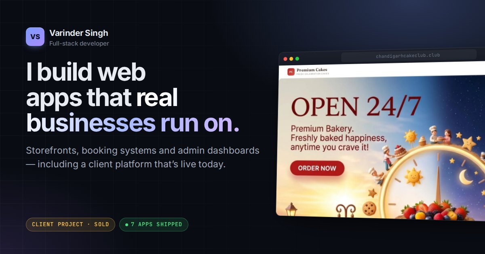

# Varinder Singh — Portfolio

Personal portfolio of **Varinder Singh**, full-stack developer and B.C.A. student from Mohali, India.

## What's inside

- **Client work** — [Premium Cakes](portfolio-details-premium-cakes.html), a production online ordering platform built and sold to Well Baked Bakery ([live site](https://chandigarhcakeclub.club/)).
- **Learning projects** — six full-stack apps (the Business Growth Agent series and the ARIA AI agent), each with a case study.
- **Resume** — web version plus a one-page PDF in `assets/Varinder-Singh-Resume.pdf`.

## How it's built

Hand-written HTML, CSS and JavaScript — no framework and no build step.

- `assets/css/main.css` — the full design system (tokens, layout, components)
- `assets/js/main.js` — small, dependency-free interactions (mobile nav, scroll reveal, lightbox, copy email)
- `assets/fonts/` — self-hosted Inter and JetBrains Mono
- `assets/img/work/` — optimised WebP screenshots

Deployed as a static site (see `render.yaml`).

## Contact

varindersinghofficial338@gmail.com · [github.com/VarinderSingh68](https://github.com/VarinderSingh68)
